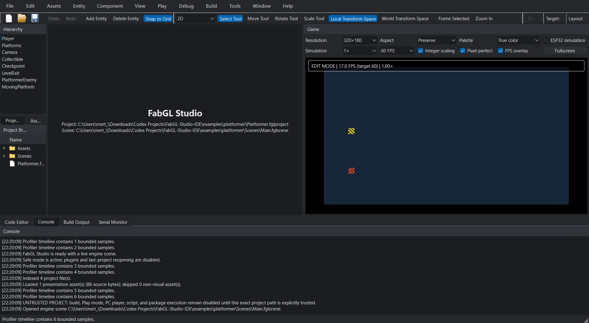

# FabGL Studio user guide

FabGL Studio 0.1 is a development snapshot, not a finished consumer release. The portable
engine, command-line project and asset tools, deterministic PC player, Qt 6 editor, and automated
tests are usable today. The repository-managed desktop toolchain pins Qt 6.8.3 and MinGW 13.1.
ESP32 firmware can be compiled with its separately pinned toolchain; upload and peripheral
behavior remain hardware-verification tasks.

## Install or run from a build

After a release build, stage or package the application as described in `BUILDING.md`. A ZIP
package is self-contained for the host executables it contains; it does **not** embed the large
ESP32 toolchain archives. Keep the extracted directory writable if you want tools to create
projects beside it.

From a developer build, the principal programs are:

| Program | Purpose |
|---|---|
| `FabGLStudio` | Qt desktop editor; only produced when matching Qt 6 is found |
| `fabgl_player_pc` | Native Windows or headless deterministic preview |
| `fabgl_project_cli` | Create, validate, and migrate projects; manage local directory packages |
| `fabgl_asset_compiler` | Convert images, audio, tilemaps, low-poly meshes, and bitmap fonts; build/inspect packs |
| `fabgl_toolchain_manager` | Inspect a pinned ESP32 installation and print a safe compile command |

Run any command-line program with `--help` for its implemented syntax.

## Create and validate a project

```powershell
fabgl_project_cli new "C:\Games\My First Game" "My First Game"
fabgl_project_cli validate "C:\Games\My First Game\My First Game.fglproject"
```

Creation refuses to overwrite an existing project file. It creates `Assets`, `Scenes`,
`Scripts`, and `Packages`, plus a valid main scene. Paths with spaces and Unicode are supported.
Source paths stored in a project must remain relative and inside the project root.

The current `.fglproject` schema is v2. It stores the canonical asset GUID/path/type table, input
contexts/actions/axes, package requirements, and explicit PC/ESP32 target-profile IDs. The CLI
and Qt editor both validate those fields. Studio can open a v1 manifest and migrates it to v2 on
the next save without discarding the v2 model. The editor shows the selected manifest profile in
**Targets / Device** and blocks build/upload when that profile is unsupported by the running
Studio build. Game View resolves manifest-bound visual assets through the same bounded project
asset library used by the PC player. Missing or malformed visual assets are reported in Console
and fall back to placeholders; they do not prevent the project from opening.

## Add and compile C++ gameplay scripts

Generate a reflected `ScriptComponent` without replacing existing source files:

```powershell
fabgl_project_cli new-script "C:\Games\My First Game" PlayerController
```

The command creates the reflected desktop component, a bounded
`Scripts/ESP32/<Class>Esp32` companion, and guarded module glue for both targets. It maintains
`Scripts/FabGLStudioScripts.cmake` and creates a managed root `CMakeLists.txt` only if the project
has none, so an existing custom CMake project remains intact.
Build all `.cc`, `.cpp`, and `.cxx` files below `Scripts` against the installed SDK with:

```powershell
powershell -NoProfile -ExecutionPolicy Bypass -File scripts/build_project_scripts.ps1 `
  -ProjectPath "C:\Games\My First Game\My First Game.fglproject" `
  -SdkRoot "C:\FabGLStudio"
```

The command performs a real strict compile and link. Errors appear in the compiler's normal
`file:line:column` form. In a developer checkout, `compile_commands.json` is written below
`out/project-scripts/<projectGuid>/build/<configuration>`; an installed copy uses your local
application-data directory. An empty `Scripts` directory or any symlink/junction in its tree is
rejected explicitly. Use `-DryRun` to inspect the validated plan. Studio does not replace live C++
objects in process. When a clean C/C++ file below `Scripts` is saved or reloaded while Studio Play
(playing or paused) or the external PC player is active, Studio stops that preview, runs the unified
PC Debug/Release build, validates the result/module boundary and SHA-256, then fully restarts the
same preview kind. Saves during a build coalesce into one additional build; cancellation, compiler
failure, invalid output, trust/profile failure, and pre-build extension failure leave the preview
stopped with a visible diagnostic. The authoring scene is preserved. Safe Mode continues to keep
extension hooks disabled rather than bypassing their policy. A scene requiring native scripts fails
explicitly when no verified module is available.

The repository examples can be validated the same way. Their `previewDemo` field selects one
of the current deterministic demonstrations. The showcase scenes exercise distinct render paths,
but remain compact regression examples rather than finished games.

## Manage local packages

Install a package source directory into the project's managed `Packages/` tree, then inspect or
validate the complete dependency graph:

```powershell
fabgl_project_cli package install `
  "C:\Games\My First Game\My First Game.fglproject" `
  "C:\PackageSources\org.example.camera-shake"
fabgl_project_cli package list "C:\Games\My First Game\My First Game.fglproject"
fabgl_project_cli package validate "C:\Games\My First Game\My First Game.fglproject"
fabgl_project_cli package remove `
  "C:\Games\My First Game\My First Game.fglproject" org.example.camera-shake
```

The source directory must contain `fabgl.package` and stay outside the project's root and
`Packages/` directory. Installation copies normal files through a verified staging directory,
canonicalizes legacy manifests, and writes a deterministic `Packages/fabgl-packages.lock`.
Commit that lockfile with the project. Removal is blocked while another installed package still
depends on the requested ID.

Packages containing native code, scripts, build files, binaries, WebAssembly, shebang files, or
typed extension entry points are blocked by default. Review the exact source and opt in for that
install only with:

```powershell
fabgl_project_cli package install `
  "C:\Games\My First Game\My First Game.fglproject" `
  "C:\PackageSources\org.example.camera-shake" --allow-executable
```

Approval is stored separately in `Packages/.fabgl-package-trust`, bound to the package ID,
version, and installed SHA-256. A package cannot grant itself trust through its manifest, and any
content change invalidates validation. Symbolic links, junctions/reparse points, traversal,
case-colliding names, special files, and over-limit packages are rejected. Unexpected or unowned
entries in `Packages/` stop package operations instead of being deleted.

This workflow installs and validates local directories; it does not download packages, verify
publisher signatures, build or dynamically load extension code, or provide a sandbox. Archive
and online-registry formats are not defined. See `PLUGIN_DEVELOPMENT.md` and `PACKAGE_FORMAT.md`
for the manifest and security contracts.

## Run the PC preview

Build and exercise an actual project through the complete validation/script/runtime path with:

```powershell
powershell -NoProfile -ExecutionPolicy Bypass -File scripts/build_project.ps1 `
  -ProjectPath examples\platformer\Platformer.fglproject -Target Pc -Configuration Release
```

The PC result records project/package validation, an optional verified native gameplay module,
and the headless runtime output. The graphical Studio **Build** button uses this same orchestrator;
**Play on PC** passes the verified module to the player when the project contains native scripts.
The player reads Scene v2 components and the manifest GUID-to-asset table rather than selecting a
procedural demo from manifest metadata.

On Windows, this opens an interactive native window:

```powershell
fabgl_player_pc --demo 2d
fabgl_player_pc --demo topdown
fabgl_player_pc --demo raycast
fabgl_player_pc --demo racer
fabgl_player_pc --demo lowpoly
fabgl_player_pc --demo ui
fabgl_player_pc --demo audio
fabgl_player_pc --demo animation
fabgl_player_pc --demo streaming
```

Use arrow keys or WASD, Space for the primary action, and Escape to exit. Project bindings can
also address `Key.A`–`Key.Z`, digits and common navigation/modifier keys; real mouse buttons,
normalized position, per-frame delta and wheel controls under `Mouse.*`; and the first XInput
gamepad's sticks, triggers, D-pad and buttons under `Gamepad.*`. Missing controllers produce zero
values, and native mouse/gamepad input is never synthesized from an unrelated keyboard key. The
low-poly path is experimental. To produce a deterministic frame without a window:

```powershell
fabgl_player_pc --headless --demo raycast --output frame.ppm
```

Use `--record-input run.fglreplay` and `--replay-input run.fglreplay` to capture or replay the
bounded canonical PC control snapshot. Replay v2 retains named keyboard, mouse and gamepad float
controls; the reader also accepts legacy v1 direction/action recordings. The checksum printed by
headless mode is useful for regression tests. It is not an ESP32 performance measurement.

## Convert assets

```powershell
fabgl_asset_compiler image hero.png hero.fgli --width 32 --height 32 --colors 16 --dither
fabgl_asset_compiler thumbnail hero.png hero-thumb.fgli --max-width 128 --max-height 128
fabgl_asset_compiler audio music.wav music.fgla --rate 22050 --stream
fabgl_asset_compiler tilemap level.csv level.fgltilemap
fabgl_asset_compiler tilemap level.json level.fgltilemap
fabgl_asset_compiler tileset terrain.fgltileset `
  --guid 26b2d039-7f1e-4a29-bc76-e51775654809 --name Terrain `
  --image 7a20b50d-681a-4d78-957f-753272822dbd `
  --tile-width 8 --tile-height 8 --count 64 --columns 8 --collision 1,2,9
fabgl_asset_compiler mesh scenery.obj scenery.fglm
fabgl_asset_compiler font terminal.bdf terminal.fglf --atlas-width 128
fabgl_asset_compiler inspect-asset level.fgltilemap
fabgl_asset_compiler inspect-asset terrain.fgltileset
fabgl_asset_compiler pack build-assets.txt game.fglpack
fabgl_asset_compiler inspect game.fglpack
```

PNG/JPEG/BMP decoding is implemented through Windows Imaging Component. WAV input must be PCM.
The command fails on invalid data rather than emitting a partial result. Crop/grid slicing,
sprite-atlas metadata, delta-compressed audio, aspect-preserving thumbnails, bounded rectangular
CSV/flat-JSON tilemaps, UV-preserving triangulated low-poly OBJ meshes, and BDF bitmap-font atlases
are supported. Low-poly materials resolve their manifest-bound base image and use nearest-neighbor
sampling over complete textures or small atlas regions. Compiled `FGLI`, `FGLT`, `FGLX`, `FGLM`,
and `FGLF` files can be validated with
`inspect-asset`.

TTF/OTF rasterization and glTF/GLB import are deliberately not bundled: convert fonts to BDF and
models to the documented OBJ subset, or install a trusted format plugin. TMX, nested/general JSON
maps, skinned/animated meshes, and asynchronous SD audio prefetch are also outside the current
formats. These inputs fail explicitly instead of being copied into a firmware pack.

## Graphical editor orientation

The image below is a real Windows Qt capture produced by the Studio executable while the bundled
Platformer project is open in safe mode. It is not a mockup or a substituted web UI.



Regenerate the capture from a matching built tree with:

```powershell
$env:QT_QPA_PLATFORM = 'windows'
out\build\release\apps\studio\FabGLStudio.exe `
  --safe-mode --no-reopen-last-project `
  --screenshot docs\images\studio-overview.png `
  examples\platformer\Platformer.fglproject
```

The corresponding dock map is:

```text
+----------------------+-----------------------------+----------------------+
| Hierarchy            | Scene / Game                | Inspector            |
| entity selection     | authoring and preview       | selected transform   |
+----------------------+-----------------------------+----------------------+
| Assets / Project     | Code Editor                 | Profiler             |
+----------------------+-----------------------------+----------------------+
| Console                         | Build Output                              |
+---------------------------------------------------------------------------+
```

The screenshot path is also exercised through a noninteractive Qt launch. The offscreen smoke
suite verifies behavior independently; a release candidate still requires human DPI,
accessibility, and keyboard-navigation review. See `EDITOR_GUIDE.md` for the controls.

## ESP32 workflow

The release-locked profile is `olimex-esp32-sbc-fabgl-revb` in
`toolchains/manifest.json`. The project's `targetProfiles.esp32` value must select that exact
profile for Studio build/upload actions. Inspect the local installation before compiling:

```powershell
fabgl_toolchain_manager inspect --manifest toolchains/manifest.json --repo .
```

The manager reports paths and mismatches. `compile-command` prints a program/argument model but
does not execute an upload. Upload always requires an explicitly confirmed board and serial
port. Follow `TOOLCHAIN.md` and `HARDWARE_TESTING.md`; a CH340 serial adapter alone does not
prove that the connected device is an ESP32-SBC-FabGL.

ESP32 project builds compile the canonical scene/assets and a guarded portable gameplay module
from `Scripts/ESP32`. The module has fixed-capacity version-1 `Start`/`Update` callbacks and is not
the desktop C++20 binary. Build results state whether the portable runtime was included and retain
its source count, binary hash, flash usage, and static RAM usage. A successful compile still does
not open a serial port or upload firmware.

Before preparing or exporting an ESP32 project, the CLI applies the same fixed-capacity contract
as the firmware reader. The current target scene supports `Transform`, `Camera`,
`SpriteRenderer`, `CharacterBody2D`, `VehicleController`, `RaycastMap`, and
`FirstPersonController`; supported manifest payloads are bounded indexed images, racer tracks,
raycast maps, and explicit `.bin`/`.dat`/`.raw` data for portable native modules. Scene hierarchy,
X/Y rotation, Z scale, audio, tilemaps, meshes, materials, animation, prefab links, physics/UI/AI
components, and other desktop-only features are rejected with entity/asset context instead of
being silently discarded. Custom unknown components are reported separately from known but
unported built-ins. The firmware does not contain a visual-script VM, so `.fglvisual` assets and
`VisualScriptComponent` fail ESP32 preparation; use a bounded `Scripts/ESP32` native companion
when target gameplay is required.

## Data safety and recovery

Project and scene saves use atomic replacement, and the editor warns before closing modified
project, scene, or code data. While authoring data is modified, Studio writes an atomic recovery
snapshot every 30 seconds and retains the five newest snapshots for that project. A session
marker detects an unclean exit; **File > Recovery Sessions** lists snapshots, identifies corrupt
entries, and lets you restore or discard them. Restore creates bounded `.bak.1` through `.bak.3`
copies before atomically replacing project and scene files.

The last project reopens on a normal launch. Use `--no-reopen-last-project` to suppress that,
`--disable-plugins` to disable plugins for one session, or `--safe-mode` to disable both plugins
and automatic reopening. Telemetry is off. Projects opened from disk are untrusted by default;
build, Play, PC-player, script, and package-hook execution stay disabled until you explicitly
trust that exact project path. Trust decisions live in editor settings, not in the project
manifest, so a project cannot mark itself trusted. Recovery is not a substitute for source
control and external backups. Do not edit generated `.fglpack`, `.fgli`, or `.fgla` files by hand.

## Troubleshooting

- If `FabGLStudio` is absent, configure with a Qt 6 build matching the compiler ABI.
- If a sample does not open in the editor, validate it with `fabgl_project_cli`; the CLI and Qt
  editor both accept current v2 manifests and report unsupported versions or unsafe fields.
- If a build command fails in the editor, inspect Build Output; it launches the configured
  executable directly, without a command shell.
- If ESP32 inspection reports `buildReady: false`, fix every reported version/path mismatch
  instead of allowing an unpinned toolchain.
- Treat PC resource and frame statistics as estimates until a hardware report records them.
